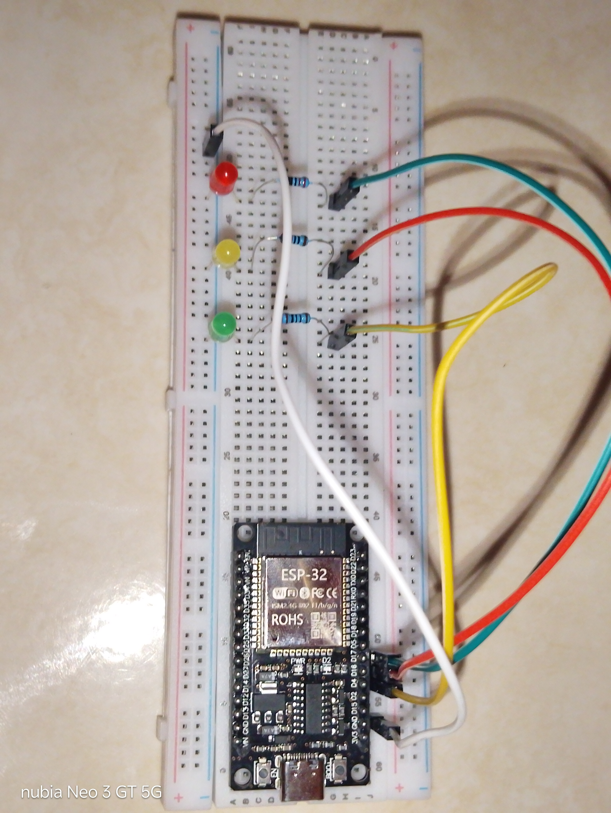

# 💡 ESP32 WiFi Lamp Control

Simple ESP32 project to control **3 LEDs** from a web browser using
**Arduino WebServer**, **HTML**, and **JavaScript Fetch API**.

------------------------------------------------------------------------

## ✨ Features

-   🌐 ESP32 creates its own WiFi Access Point.
-   💻 Control LEDs directly from any web browser.
-   💡 Controls 3 LEDs (GPIO 4, GPIO 16, GPIO 17).
-   🔄 Buttons automatically toggle between **Hidupin** and **Matiin**.
-   ⚡ Uses `fetch()` so the page doesn't refresh.

------------------------------------------------------------------------

## 🔌 Wiring Diagram



------------------------------------------------------------------------

## 🛠 Hardware

-   ESP32 DevKit
-   3× LED
-   3× 220Ω Resistor
-   Breadboard
-   Jumper Wires

------------------------------------------------------------------------

## 📍 GPIO Mapping

      LED  GPIO
  ------- ------
    LED 1   4
    LED 2   16
    LED 3   17

------------------------------------------------------------------------

## 🚀 Getting Started

1.  Open the project in Arduino IDE.
2.  Upload the sketch to your ESP32.
3.  Connect to the WiFi:

``` text
SSID: wifi lampu
Password: (empty)
```

4.  Open your browser:

``` text
http://192.168.4.1
```

5.  Click the buttons to control each LED.

------------------------------------------------------------------------

## 📂 Project Structure

``` text
ESP32-WiFi-Lamp-Control/
├── assets/
│   └── foto.jpg
├── ESP32_WiFi_Lamp_Control.ino
├── README.md
└── LICENSE
```

------------------------------------------------------------------------

## 📜 License

This project is licensed under the MIT License.

If this project helped you, consider giving it a ⭐ on GitHub!
